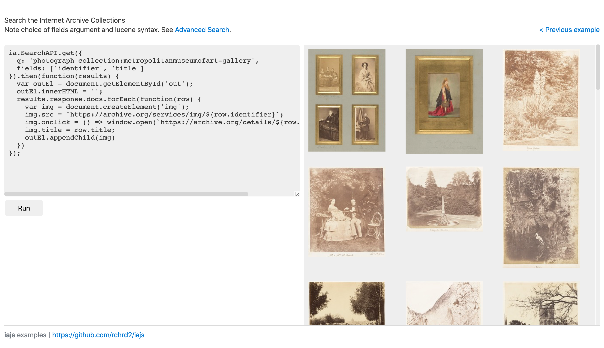

WIP Internet Archive JavaScript and NodeJS client

NOTE: This is in an experimental phase and it will probably change a lot.

## Live demos

<https://rchrd2.github.io/iajs/examples/web/01.html>

## Planned features

### p0

- ✅ Read item metadata and list of files (Metadata API)
- ✅ Update item metadata (Metadata API)
- ✅ Search (Search API)
- ✅ Search gifcities.org (GifCities API)
- ✅ Query related item API (Related Items API)
- ✅ Sign in with user/pass (Xauthn API)
- ✅ Sign in with s3 tokens
- ✅ Sign in from cookies
- ✅ Add reviews (Reviews API)
- ✅ Add page to Wayback (Save Page Now API)
- ✅ Query the Wayback Machine (CDX and Available APIs)
- ✅ Add/remove/list favorites

### p1

- Upload item files
- Create items
- Generate embed codes for books/videos/music files in item
- Include a JSON diff library
- List reviews by user
- TV
- Radio
- Add OpenLibrary.org APIs
- Add BookReaderJSIA aka manifest API
- Add Book IIIF API
- more tbd

### Library TODO:

- ✅ Examples using non-compiled code straight in the browser. Eg unpkg
- Include examples in the README

## Misc

Note:
I wanted to build this while I worked at Internet Archive, but did not have the bandwidth

See Also:

- Official Internet Archive Python Client - https://github.com/jjjake/internetarchive

---

Screenshot of web usage example

